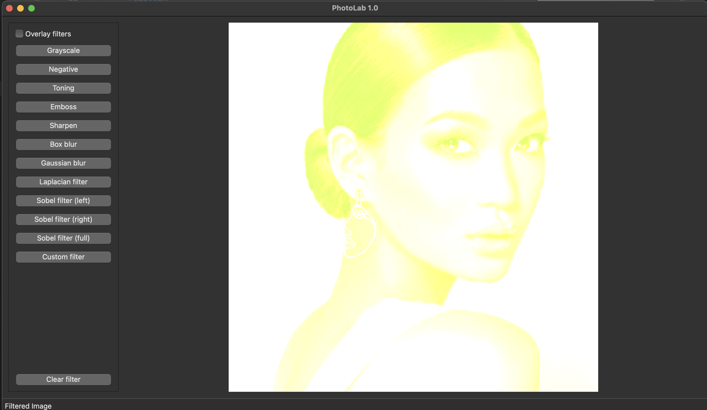

# PhotoLab Project in Qt/CPP

PhotoLab v1.0 is an open-source image processing application developed in C++17, using the Model-View-Controller pattern and a GUI library with API for C++17. The program provides a pool of ready-made filters, including conversion to grayscale, negative, and toning, as well as the ability to apply convolution filters such as emboss, sharpen, box blur, Gaussian blur, Laplacian filter, and Prewitt filter or Sobel filter. Additionally, the program allows the user to enter an arbitrary filter kernel matrix (up to size 16x16) by hand through a separate dialog window.

## Dependencies

PhotoLab v1.0 uses the following dependencies:

- CMake 3.15 or higher
- Qt5 (Widgets module)
- GTest (for unit tests)

## Build

To build PhotoLab v1.0, please follow these steps:

1. Clone this repository to your local machine.
2. In the terminal, navigate to the project's root directory.
3. Run the following command to build the project: `make all`

To rebuild the project, run `make rebuild`. To clean the project, run `make clean`.

## Usage

To use PhotoLab v1.0, please follow these steps:

1. Open the program by running the executable.
2. Load an arbitrary image in BMP format using the "Load Image" button.
3. Apply a filter from the pool of ready-made filters or enter an arbitrary filter kernel matrix using the appropriate buttons.
4. Save the result of filtering into a separate file (BMP format) using the "Save Image" button.

### Examples

To apply the "Negative" filter to an image, follow these steps:

1. Load an image using the "Load Image" button.
2. Click on the "Negative" button.
3. Save the result using the "Save Image" button.

To apply the "Gaussian blur" filter to an image with a 3x3 kernel, follow these steps:

1. Load an image using the "Load Image" button.
2. Enter the filter kernel matrix in the appropriate dialog window.
3. Click on the "Gaussian blur" button.
4. Save the result using the "Save Image" button.

 <table border="1">
   <caption>
     Filters
   </caption>
   <tr>
     <td>Grayscale</td>
     <td></td>
     <td>Negative</td>
     <td></td>
   </tr>
   <tr>
     <td>Picking tone</td>
     <td></td>
     <td>Toning</td>
     <td></td>
   </tr>
   <tr>
     <td>Emboss</td>
     <td></td>
     <td>Sharpen</td>
     <td></td>
   </tr>
   <tr>
     <td>Box blur</td>
     <td></td>
     <td>Gaussian blur</td>
     <td></td>
   </tr>
   <tr>
     <td>Laplacian filter</td>
     <td></td>
     <td>Sobel left</td>
     <td></td>
   </tr>
   <tr>
     <td>Sobel right</td>
     <td></td>
     <td>Sobel full</td>
     <td></td>
   </tr>
   <tr>
     <td>Custom widget</td>
     <td></td>
     <td>Custom filter</td>
     <td></td>
   </tr>
 </table>

## License

PhotoLab v1.0 is licensed under the MIT License. See the [LICENSE](LICENSE) file for more information.